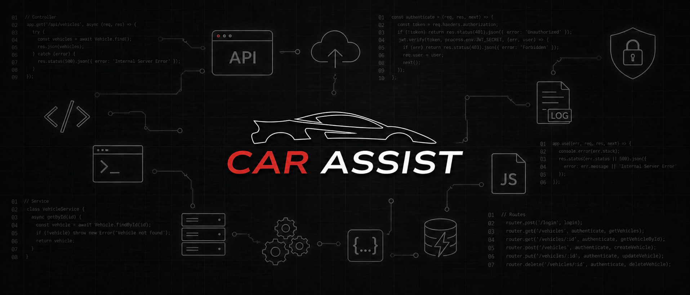

# Car-Assist_Back-End

## Car Assist

Empresa especializada no desenvolvimento de aplicações voltadas para o setor automotivo, com foco na gestão, monitoramento e manutenção de veículos.

## Repositório

- [Principal](https://github.com/Bre01cc/Car-Assist)

## Sobre

Este repositório é destinado ao desenvolvimento do back-end da aplicação **Car Assist**. Nele estão concentrados o código-fonte da API, a documentação Swagger dos endpoints, a organização estrutural do projeto e as tarefas relacionadas à evolução do sistema.

## Pré-requisitos

## Instalação 

## Tecnologias
| Tecnologia | Versão |
|------------|--------|
| Node.js | 20.17.0 |
| Express.js | 5.2.1 |
| Knex.js | - |
| Swagger UI Express | 5.0.1 |

## Estrutura do Projeto

- 📁 `assets/`

- 📁 `controller/`

- 📁 `model/`
    - 📁 `DAO/`
    
- 📁 `routes/`

## Descrição das Pastas
### assets
Diretório responsável por armazenar arquivos estáticos utilizados no projeto, como logos, imagens e outros recursos visuais.

### controller
Contém os controllers da aplicação. Essa camada recebe as requisições HTTP, processa os dados recebidos, aciona as regras de negócio e retorna as respostas ao cliente.

### model/DAO
Contém os arquivos DAO (Data Access Object), responsáveis pela comunicação direta com o banco de dados, realizando operações como inserção, consulta, atualização e remoção de registros.

### routes
Armazena os arquivos de rotas da aplicação. Define os endpoints disponíveis e direciona cada requisição para seu respectivo controller.

## Autores
- [@Breno Reis](https://github.com/Bre01cc)
- [@Guilherme Moreira](https://github.com/Guilherme1108)
- [@Gustavo Mathias](https://github.com/Gustaxsx)
- [@Nikolas](https://github.com/nikolasfernnds)
